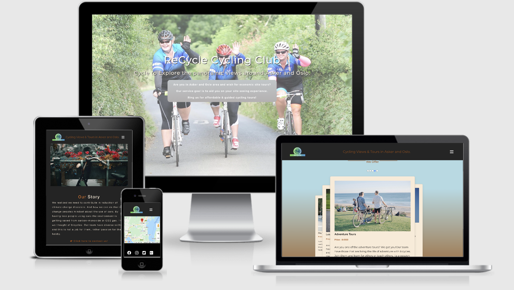

# Recycle Cycling Club

## <i> HTML / CSS website with google API map </i>

---

> **Recycle Club** - is an local cycling  where you can get tours aroundd the selected areas. Enjoy!

---

# An Eco-friendly cycling club.

## Demo responsive image display

- New website

The main processes were observed. Google search was used for research to find similar websites for business doing offering the same services. These included sites like Alaskabike [Alaskabike](https://www.alaskabike.com/home.html?gclid=CjwKCAjwguzzBRBiEiwAgU0FTzGm5_JVcN2WUotdB5yS5zzujKWptGE_MZ0dL6c_0UGh5M6Yf1-c8hoCf8UQAvD_BwE), [baliecocycling](https://baliecocycling.com/cycling-tour/). To gather other ideas on how I can design the structure of my webpage I looked into sites like adobe creation cloud, [dribbble.com](https://dribbble.com) and [behance.net](https://behance.net) for design ideas.

This is a demo to show how the site is responsive across different browsers 
[Link](https://www.linkedin.com/learning/css-page-layouts-2012/page-design-workflow?u=43268076)

## Introduction

This is a project to design a website for a cycling club. The fact that it is trying to encourage eco-friendly cycling. The requirements for the site was looked into and used to come up with user stories, which were created to direct the direction of the tasks for the development process. A gantt chart and site map could be a nice possible process to map the design process. However it was not possible at this stage due to the limited time the designer had. The purpose is to attract interest and more visitors to use the services and contribute on making the activities used by users inland and outland.

Followed a model by [James Williamson, 2012](http://kayalvaer.no/ms1git_dir/index.html) which advice on not just focusing on coding but to also consider other stages like typography, color choice and the structure of the webpages should be right, even though the time did not allow me to do all the processes. The aim was to follow his model.

## UX

#### Function Specification

The persona for the website is targeting cyclists living in the area looking for others with same interest, families looking for something to do, visitors of the area looking for cheaper way of travelling around without harming the environment and with the guide of someone who knows the area. Eco-friendly advocates are also targets.

#### Motivation

The motivation behind the services that Re-Cycle club offer aims to achieve the following;

- Diversify their services
- Support the community by encouraging social connections through - - arranging family cycling tours.
- Eliminate energy or electricity wastage.
- Promote cycling instead of driving.
- Offer quality service.

#### Desire

Customers want from the website;

- See the diverse services offered by ReCycle
- Make users be aware of club employees competencies.
- Portray Re-cycle as an environmentally and eco-friendly brand.
- Allow users to book services online and write their desire comments.
- Support the community by encouraging social connections through arranging family cycling tours.
- To contribute and share their own skills to influence others with their hobby and explore their skills.
- Users can benefit and use the knowledge they can achieve from Re-cycle club core members.

## Features

The site has 4 pages:

- Home Page: the landing page gives the visitor access and link to important pages in the website. Information of comments from past users of the club can show trust for potential users. Also a fixed navigation on top of the display screen for easy navigation.
- About Us Page : gives information about the history of the club, employees and their experience.
- Tour Page: shows the target clients or persona of the visitors. Also tour options offered by club, for visitors to be aware of the services. Images and contents for some of the tour services are provided to give potential visitors an idea on what to expect.
- Contact Us Page: a form to contact us for a booking or be a member. The location of the club also is shown in this page, to direct users where to go with a schedule of opening times visible to visitors.

#### Deleted Features

From the first wireframing stage the plan was to include gallery page however I thought the images accompanying the tour options are enough. Trying to avoid having too many images that can affect the loading speed of the site.

### Features Left to Implement

- Gallery page to show videos and images of past activities with users can be helpful to the site and interesting to users. however not too many videos to be used as the this is a hazard to the speed perfomance of the site.

- Automization of some features of the website would make it more interesting to the users especially younger generation and increase traffic to the site and to make it more engaging. Generally with more time the site will be improved.

## How will the users achieve their goals:

The aim as a developer is to design a completely responsive website that is carefully optimized for SEO and WCAG and tested for devices of all sizes. The website must be user friendly for all including users with visual impairment, Meta tags used to attach traffic to the site with content that the users use.

A mind map can be used to explain the connection between the user-stories and pages designed in order to identify key interactions. However, for this project a mind map was created like below to help me layout the interaction of the content on the pages.

## User Stories

To uncover the process gaps, make us investigate our guests thorough, helps us to find out what motivates our users to search and use the services. Lastly user stories shows us available opportunities to better the club and services to offer.

- As a user I want to know the opening hours of the club so that I can decide the time suitable for me to use the services.
- As a user I want to know the location and contacts of the club so that I do not get lost and I know where to find the club site.
- As a user I want to navigate quick on the site so that I do not waste time.
- As a user I want to know about the club so that I can relate to the history behind their services and the benefit to the community.
- As a user I want full description of tours so that I can see the options offered.
- As a user I want to have an idea of tours, through images so that I can decide if it interest me.
- As a user I want to have an idea of the fees for the services offered by the club so that I can plan my trip appropriately.
- As a user I want to link to all sides of the website so that I do not get lost looking for information.
- As a user I want to know which page of the site I am viewing so that I do not get lost around the site.
- As a user I want to know the contacts of the club so that I do not get lost and will know where to reach them.

## SEO and WCAG Optimization

SEO and WCAG guidelines were taken into consideration when making this project. Important tools for testing contents like matching fonts and colors have been used during the process in order for the site to be user friendly for all and the information and material relevant to ICT solutions. This is important process also to attract useful traffic to the “Re-cycle” website using right content and putting popular or used keywords for the theme in order to maximize sales potential and for e-commerce benefits of the services offered.

To ensure that my design is SEO optimized I used search engines like [Google trends](https://trends.google.com/trends/explore?geo=NO&q=reliable%20Web%20hosting%20services,web%20hosting) or [Google ads](https://ads.google.com/aw/campaigns/new/express?campaignId=9479432298&ocid=410183982&cmpnInfo=%7B%228%22%3A%2218d78f35-e130-4403-ae54-0344fa4473a0%22%7D&subid&step=cpas&authuser=0&__u=1262186748&__c=3244710718). Looking at the monthly volume to find out the keywords that rate high or which the users are searching for. I also picked long tail keywords as mentioned by [David Booth tutorial on linkedin-seo-foundations](https://www.linkedin.com/learning/seo-foundations-2/leveraging-the-power-of-search-to-accomplish-your-business-goals?u=43268076). These are words which combine a lot of searched words and they are very effective for a good SEO strategy. The words which came up on the SEO strategy tools which are visible on the page links which ranked high on the statistics was used to write the text content of this project as they were recommended keywords. It is vital that the keywords on the site are searched by the consumers and are specific phrases to the project.

#### WCAG optimization

Users with social needs were considered during the design of the website. Avoiding text on pictures and that also influenced my color choice. The idea was to make my layout as simple as possible without compromising important information and with less text.
For this website I used the [achecker site](https://achecker.ca/checker/index.php) to check the accessibility review of the site and it scored Level 92% AA with 4 errors. According to [Desarrollweb](desarrollweb.dlsi.ua.es) a level of AA means the site is most compliant.

## Virsual characteristics

Taking into consideration the important of typography, color choices and blending them with the mood of the design was important process of this project.

#### Color:

As mentioned I used the hero image to capture my color palette on Adobe capture and I came up with the colors which I was comfortable with and incorporated in my design. They represent a variant, modern feel to our site to attract the target visitors (figure 1.2 below). The colors are a mixture of bright and natural colors and they blend good together for the site. However I had to adjust the brightness of the colors during development and not all colors were used but swapped with stronger related colours like #5f8f18, #400c07 and #891E00. Used [mycolor.space](https://mycolor.space/?hex=#57C2C5&sub=1).

The goal is to maintain trust from the users so that they can buy the products and recommend to others. The discovery was that many competitors used blue, white and sky colour. The color blue represent intelligence, communication, trust, quality and the lime I included is for trust and security, then white for efficiency (David kadavys, 2011).

#### Choice of Typography

The type of typography for this design was carefully done in order avoid using many fonts. To fonts can provide a dynamism and sophistication that is hard to get when using a single font. The leading two has to balance and spacing on the fonts was made friendly and easy to read for people of ages. I had to check the fonds using google fonts and [paratype.com](https://www.paratype.com) to see first how the font looks like. Fonts which are readable on screen and serious.
[Google fonts](https://fonts.google.com/): Was used to get the required typo. I used Roboto and Montserrat for the font family in this site. The fonts match well and I used google font pairing tool and [Typetester](https://www.typetester.org/dashboard/) to test how the font looks like. The aim was to have a modern type style that can be easy to read.

## Wireframes

A wire-framing process was done to oversee how the site structure will be presented and to ensure that the content layout is on the grid for proper display on both mobile and desktop displaysThe wireframe designs are displayed of figma [Link](https://www.figma.com/file/1nOonNFnKknkiL5XfPfW5o/Wireframing-Copy?node-id=211688%3A629). I took the initiative to learn figma and use it for the UX designs of this project.

#### Languages and Frameworks:

- [HyperText Markup Language](https://www.w3schools.com/html/default.asp)

- [Cascading Style Sheets](https://www.w3schools.com/css/default.asp)

## Technologies Used

[Git](https://git-scm.com/) - Version control system for tracking changes to your coding projects.

[Github](https://github.com/) - A software development repository where people can host and collaborate on coding projects.

[Chrome DevTools](https://developers.google.com/web/tools/chrome-devtools) - For editing pages and diagnosing issues via Google Chrome browse

[Google Fonts](https://fonts.google.com/) - For the fonts used

[freelogoservices](https://www.freelogoservices.com/) - Free logo maker.

[Am I Responsive design tool](http://ami.responsivedesign.is/?url=https://backpocket.co#) - To check or give a screenshot of the design and show how responsive it is on different screen sizes

VScode: As my code editor.
[VScode](https://code.visualstudio.com) - As my code editor.

[Kim T Navigation tips](https://medium.com/creative-technology-concepts-code/responsive-mobile-dropdown-navigation-using-css-only-7218e4498a99) - have been helpful in helping me design my navigation.

[Fontawesome](https://fontawesome.com) - used for some of the icons on the site.

[Figma](https://www.figma.com/files/recent) - for the design of my wireframes and prototypes and lesson to use the tools.

[Wordtracker](https://www.wordtracker.com) - Used to track content keywords for SEO optimization.

[Behance](ww1.bechance.net/?sub1=20200730-1025-3459-8329-c7ab77f8c377)

[Google maps](https://www.google.com/maps/place/Tøyengata+50,+0578+Oslo/@59.9164178,10.7705758,17z/data=!3m1!4b1!4m5!3m4!1s0x46416e5bfb2c8371:0x908d416b1fb283d2!8m2!3d59.9164178!4d10.7727645) - to show the location on the museum.

[Responsive Viewer](chrome-extension://inmopeiepgfljkpkidclfgbgbmfcennb/index.html) - A google chrome extension used to check or test the responsive of the site on different screen sizes

[Tinypng](https://tinypng.com)

[Jindo.com](https://www.Jindo.com) - for the free design of my logo.

[Adobe capture app](https://helpx.adobe.com/mobile-apps/help/capture-faq.html)- used to capture the color on the hero image and use the palette for my design.

[Pingdom](https://my.pingdom.com/app/3/home) - used to test the site performance.

[Codepen](https://codepen.io/Bluetidepro/pen/GkpEa) - for percentage based star rating.

[MobiReady](https://ready.mobi) - To test website performance on mobile devicesUsed for debugging.

## Testing

Testing was done on different platforms to ensure proper display across different screens and achieving a clean code. Validation of the site was done.

- [HTML](https:/validator.w3.org)

- [CSS](https://jigsaw.w3.org/css-validator/)

#### Loading Perfomance Test

Loading perfomance of the site was tested using [Pingdom.com](https://my.pingdom.com/app/3/home) and the page was loading at 3.83s as shown below.

#### Accessibility review Test

This was done to ensure the site can be used by all users without any difficulties related to disabilities. And four problems were reported. Some I was able to resolve some will be resolved soon in the future.

#### Responsiveness Test

To test the responsiveness of the side across browsers I used

[MobiReady](https://ready.mobi) - To test website performance on mobile devicesUsed for debugging.
[MobiReady results](file:///Users/kaykeatlaretsealvaer/Desktop/codeins_ms1/ms1git_dir/assets/imgs/mobiReady%20results.webarchive)

[Chrome DevTools](https://developers.google.com/web/tools/chrome-devtools) - For editing pages and diagnosing issues via Google Chrome browse

[Responsive Viewer](chrome-extension://inmopeiepgfljkpkidclfgbgbmfcennb/index.html) - A google chrome extension used to check or test the responsive of the site on different screen sizes

#### Acceptance Tests

Acceptance tests hav been done on the pages to ensure that automated scenarios are working and achieving what the user required and what the develope wish to achieve.

1. Home Page:

   1. Getting on the `Index.html` page
   2. Try to click the menu items and footer items.
   3. Check if the color changes to show you which page you in when you hover.
   4. Click the items to see if the color changes and if the links are directing you to relevant pages.

2. About Page:

   1. Getting to the `aboutus.html` page
   2. Try to click the links to book employee direct there. Saves user time of navigation around pages.
   3. Click the book button to see if it will direct you to book successfully.

3. Contact Us page:
   1. Getting to the `contactus.html` page
   2. Try to submit the empty form and verify that an error message about the required fields appears and that when you click the input the color changes.
   3. Try to submit the form with an no name or missing one of the input entries and verify that a relevant error message appears
   4. Try to submit the form with all inputs valid and verify that a success message appears.

#### Issues and Bugs:

I came across some bugs on my design which some were fixed and accessibility assessment was done using https://achecker.ca/checker/index.php and 4 problems listed below were identified:

Error 1: Input element, type of “checkbox”, has no text in label.
Error 2: Replace your <i> element with em or strong.
Error 3: Add text to the element or the title attribute of the element or, if an image is used within the anchor, add ALT text to the image.
Error 4: Label text is empty. Add text to the label element.

## Deployment

Deployment and live demo
The website is deployed on github and can be viewed on GitHub Pages (Link) [Link](https://kayalvaer.github.io/User-Centric-Frontend-Development-Milestone-Project-1//ms1git_dir).

## Credits

Am thankful to you tube contributors like [Robert Bradford](https://www.youtube.com/watch?v=dsZ9LytmsEM), New PragmaBc [New Pragmatic](https://www.youtube.com/watch?v=JbFJWHWChJE&t=15s), [Dev Ed](https://www.youtube.com/watch?v=FK4YusHIIj0&t=140s)for inspiring and helpful tips on making my UX design with a new program I have been wishing to try [Figma](https://www.figma.com/files/recent).

Credits to [Kim T Navigation tips](https://medium.com/creative-technology-concepts-code/responsive-mobile-dropdown-navigation-using-css-only-7218e4498a99) for providing a responsive navigation which was used in this project, even though customised for this project.

### Media

[Unsplash](https://unsplash.com:photosareacourtesyofbothunsplash) - For quality free downloadable images.

### Acknowledgements

Many thanks to [Akshat Garg](https://github.com/akshatnitd) and the student care team for their invaluable help, support and feedback when the going was tough. And to the Code Institute slack community for their constant support. All the lectures at Code Institute for the leading information to direct our learning and IT competencies to be future developers, a skill useful especially after the corona crisis.

> > > > > > > f09d9d1179daf528809c81fcb7cb797f059f08c1

    

---